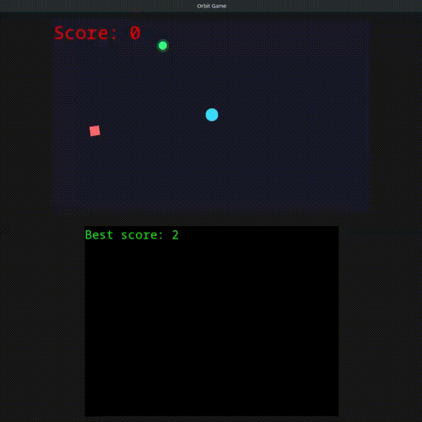

# Tridingine-3DSlib

**Tridingine-3DSlib** is a lightweight cross-platform game development library focused on **PC and Nintendo 3DS**.

Its goal is simple: **write your game once and compile it for both platforms using the same API and project structure**.

> 🚧 **Status: Early Alpha**
>
> The 2D API and core systems are currently usable. 3D rendering, sprite atlases and some Nintendo 3DS audio functionality are still under active development. APIs may change in future versions.

---

## 🎮 Orbit

**Orbit** is a small game created with Tridingine-3DSlib and included as an example.

You control a circle while enemies spawn around the edges of the screen and chase you. Collect orbs to increase your score and remove the enemies. If an enemy reaches you, the game ends.

The example demonstrates several parts of the library working together, including:

* 2D rendering
* Input
* Delta time
* Random generation
* Text rendering
* Colors
* Game state
* Score and high score
* Collision/gameplay logic



---

# ✨ Features

### 2D Rendering

The 2D API currently supports:

* Points
* Lines
* Rectangles
* Bordered rectangles
* Triangles
* Circles
* Ellipses
* Rotation
* Depth
* Alignment
* Gradients
* Text rendering
* Fonts

### Input

A platform-independent input system allows the same game code to work across platforms.

Currently supported:

* Nintendo 3DS buttons
* Circle Pad
* C-Stick
* D-Pad
* Touch screen
* PC mouse
* Virtual button mapping

### Resources

The library provides systems for working with:

* Textures
* Fonts
* Audio
* Localization
* Save data
* Random numbers
* Time
* Colors
* Vectors and other mathematical utilities

### 3D Rendering

A 3D rendering API is currently being developed.

Current experimental functionality includes:

* 3D camera
* Camera movement
* Camera direction utilities
* Models
* Cuboids
* Spheres
* Materials

⚠️ **The D3D API is highly experimental and should not yet be considered stable.**

---

# 🖥️ Platforms

| Platform           | Status               |
| ------------------ | -------------------- |
| Windows            | 🚧 Experimental      |
|  (windows needs FontsConverter libs fix)  |
| Linux              | 🟢 Supported         |
| macOS              | 🚧 In development    |
| Nintendo 3DS       | 🟢 Supported         |
| 2D rendering       | 🟢 Usable            |
| 3D rendering       | 🚧 Experimental      |
| Sprite atlases     | 🚧 In development    |
| Nintendo 3DS audio | ⚠️ Known limitations |

The engine is designed to keep the game code as consistent as possible between PC and Nintendo 3DS.

---

# 🚀 Getting Started

## Requirements

For Nintendo 3DS development:

* [DevkitPro](https://devkitpro.org/)
* CMake

For PC development:

* CMake
* A compatible C/C++ compiler

See the complete installation instructions:

**[01 - Installation](docs/01-Installation.md)**

---

## Creating a project

Tridingine-3DSlib includes **ProjectMaker**, a tool that generates a ready-to-build project from the development kit.

After building the library:

```bash
ProjectMaker -o MyGame
```

This creates a project containing the required CMake configuration, templates and build scripts.

---

## Minimal example

A basic game follows this structure:

```c
#include <Tridingine.h>

int main(int argc, char *argv[])
{
    S2S_ScreensInit();

    while (S2S_ScreensRunning())
    {
        S2S_BeginFrame();

        // Game logic
        // Rendering

        S2S_EndFrame();
    }

    S2S_ScreensExit();

    return 0;
}
```

The same project can then be built for the supported platforms.

For a complete introduction, see:

**[02 - Getting Started](docs/02-Getting-Started.md)**

---

# 📚 Documentation

The documentation is divided into several sections:

* **[01 - Installation](docs/01-Installation.md)** — Install dependencies and build the development kit.
* **[02 - Getting Started](docs/02-Getting-Started.md)** — Create and compile your first project.
* **[03 - Graphics](docs/03-Graphics.md)** — 2D and experimental 3D rendering.
* **[04 - Input](docs/04-Input.md)** — Keyboard, controller, touch and virtual input.
* **[05 - Audio](docs/05-Audio.md)** — Audio system.
* **[06 - Resources](docs/06-Resources.md)** — Resource management.
* **[07 - PC](docs/07-PC.md)** — PC-specific build information.
* **[08 - Nintendo 3DS](docs/08-3DS.md)** — Nintendo 3DS-specific development.
* **[09 - Examples](docs/09-Examples.md)** — Available examples, including Orbit.

> 🚧 Some documentation is still being written.

---

# 🛠️ Development Status

Tridingine-3DSlib is currently under active development.

The main focus is currently on improving the core systems and expanding the engine while keeping the API simple and consistent.

### Current priorities

* [x] 2D rendering
* [x] Text rendering
* [x] Input abstraction
* [x] Fonts
* [x] Save system
* [x] Localization
* [x] Random utilities
* [x] Math/vector utilities
* [x] PC support
* [x] Nintendo 3DS support
* [x] Example game
* [ ] Sprite atlas system
* [ ] Improved Nintendo 3DS audio
* [ ] Expand 3D renderer
* [ ] Expand documentation

---

# 🎯 Philosophy

Tridingine-3DSlib is designed around a few simple ideas:

* **Write the game once.**
* **Use the same API across platforms.**
* **Keep the API simple.**
* **Make Nintendo 3DS development accessible without sacrificing PC development.**
* **Keep the game's behavior and appearance consistent across platforms whenever possible.**

The engine is not intended to hide every platform difference. Instead, it provides a common foundation while still allowing platform-specific functionality where necessary.

---

# 🤝 Contributing

The project is currently in an early development stage.

Contributions, bug reports and suggestions are welcome, especially around:

* Nintendo 3DS compatibility
* PC compatibility
* Documentation
* Rendering
* Audio
* Examples
* Testing

Please keep in mind that the API may change significantly before the first stable release.

---

# 📄 License

Tridingine-3DSlib is distributed under the **Apache License 2.0**.

See [`LICENSE`](LICENSE) for the complete license text.
